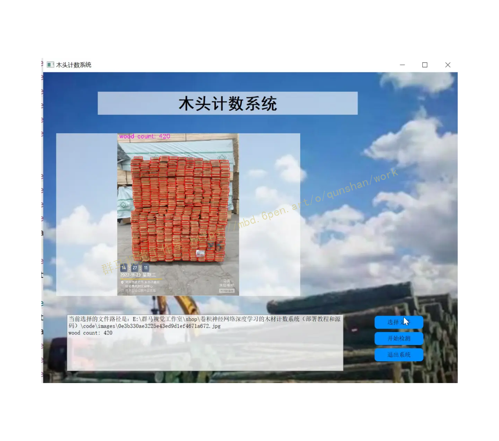
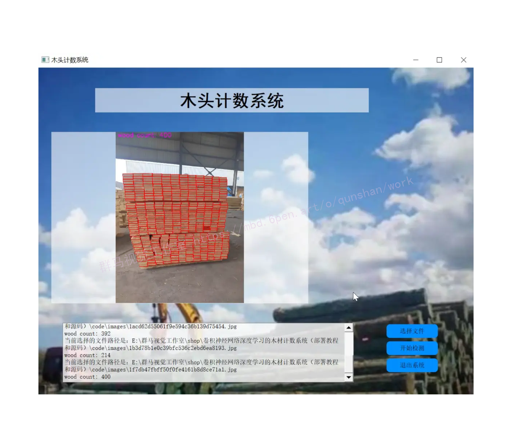
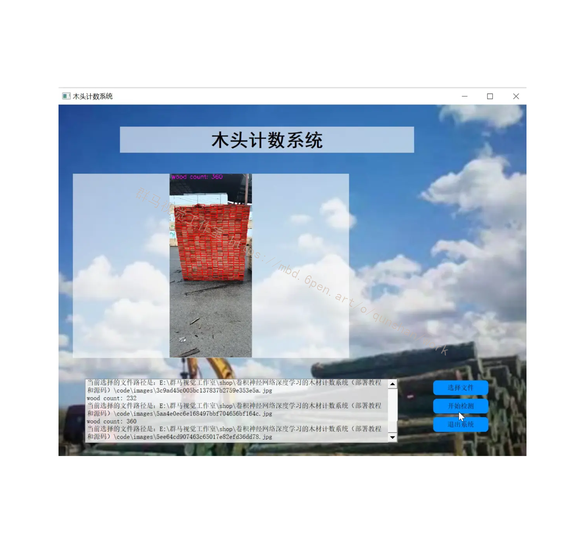
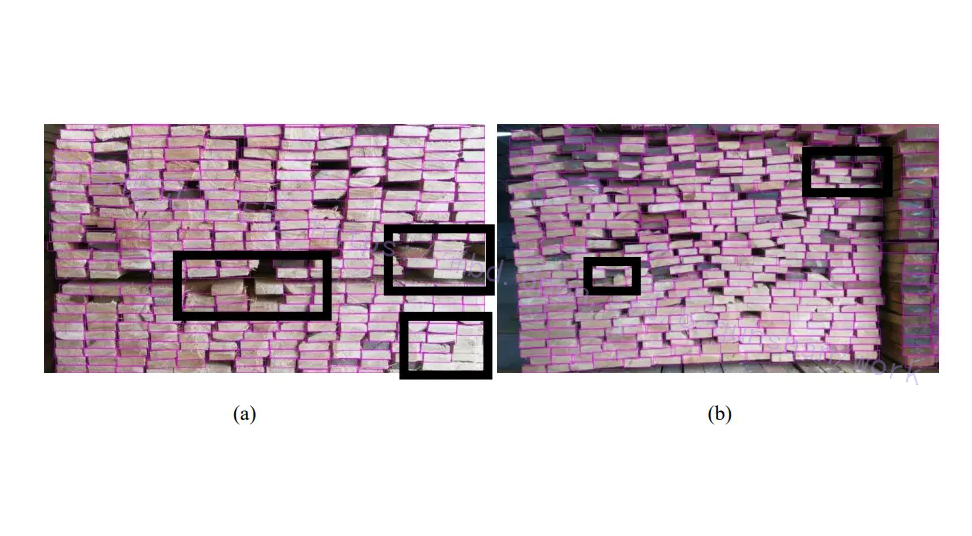
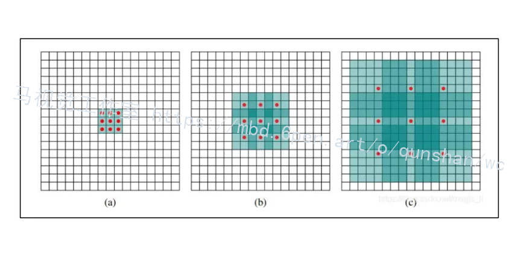
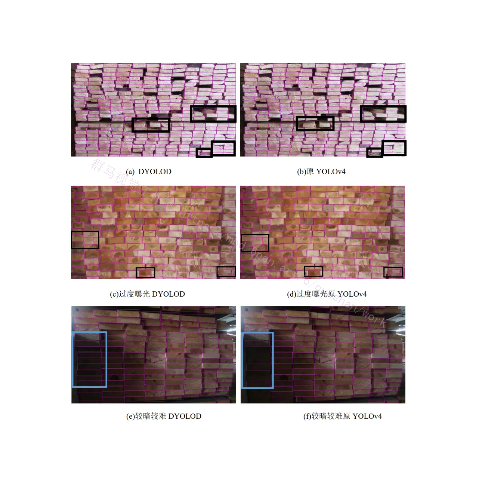
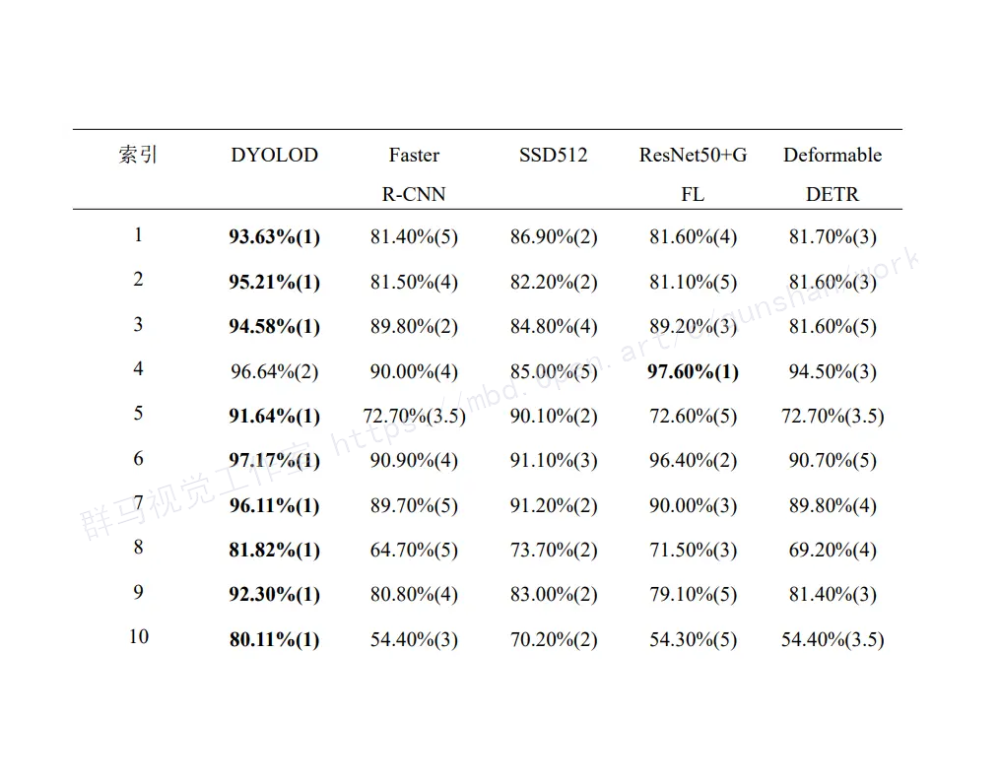
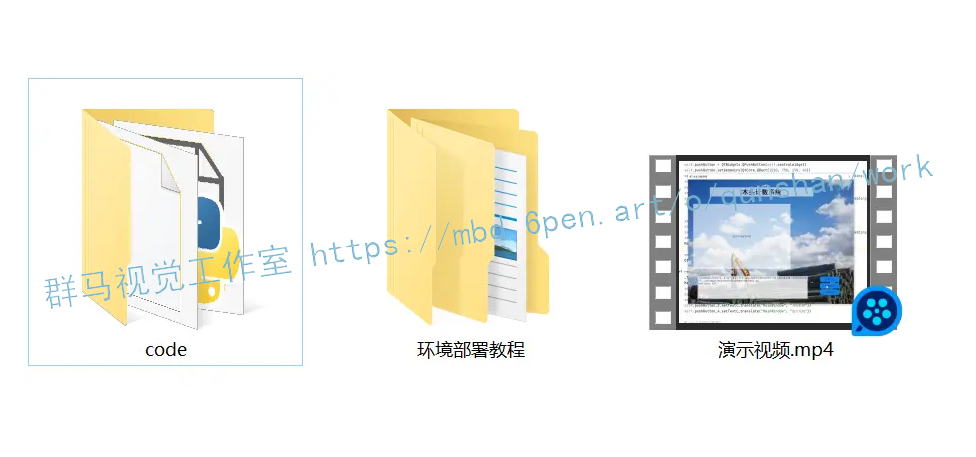



## 1.研究背景与意义


随着科技的不断发展，计算机视觉技术在各个领域中得到了广泛的应用。其中，卷积神经网络（Convolutional Neural Network，CNN）作为一种强大的深度学习模型，已经在图像识别、目标检测、人脸识别等领域取得了重大突破。然而，在木材行业中，目前仍然存在着一个重要的问题，即如何高效准确地对木材进行计数。

传统的木材计数方法主要依赖于人工操作，这种方法存在着计数速度慢、容易出错等问题。而且，随着木材行业的不断发展，生产规模不断扩大，传统的计数方法已经无法满足需求。因此，开发一种基于卷积神经网络的木材计数系统具有重要的实际意义。

卷积神经网络是一种能够自动学习特征的深度学习模型，其具有良好的图像处理能力。通过对大量的木材图像进行训练，卷积神经网络可以学习到木材的特征，从而实现对木材的自动计数。相比传统的计数方法，基于卷积神经网络的木材计数系统具有以下几个优势：

首先，卷积神经网络可以实现高效准确的计数。通过对大量的木材图像进行训练，卷积神经网络可以学习到木材的特征，从而能够在短时间内对大量的木材进行准确计数，大大提高了计数的效率。

其次，基于卷积神经网络的木材计数系统具有较高的鲁棒性。由于木材的形状、颜色等特征具有一定的变化性，传统的计数方法往往对这些变化较为敏感，容易出现计数错误的情况。而卷积神经网络通过学习大量的样本，可以对这些变化进行较好的适应，从而提高了计数的准确性。

此外，基于卷积神经网络的木材计数系统还具有较强的泛化能力。一旦训练好的模型可以应用于不同的木材图像，无论是形状、颜色还是大小等方面的差异，都可以通过卷积神经网络进行有效的计数。

综上所述，基于卷积神经网络的木材计数系统具有高效准确、鲁棒性强、泛化能力强等优势，可以为木材行业提供一种高效、准确的计数方法。本研究旨在开发一种基于卷积神经网络的木材计数系统，并提供相应的部署教程和源码，以帮助木材行业实现自动化计数，提高生产效率。

# 2.图片演示







# 3.视频演示
[卷积神经网络深度学习的木材计数系统（部署教程和源码）_哔哩哔哩_bilibili](https://www.bilibili.com/video/BV1N94y1z79y/?vd_source=ff015de2d29cbe2a9cdbfa7064407a08)


# 4.木材数量智能识别发展现状
我国对方形木材数量检测的主要方式还是采取人工检测。国外对木材进行检测使用光学检测器、激光、感应器等工具，此等设备不但价格较高，而且使用其中的光学仪器，对识别的环境有一定的要求。Herbon[5]等人提出将高斯混合模型以及图像分割等技术应用于原木计数上，对图像使用分割算法以及高斯混合模型初步分离出感兴趣区域，迭代发现和验证新的目标，直到不再发现新目标，每次迭代都会更新高斯混合模型，最终实现原木数量识别。2019年，Wu[6]等人首次提出一种深度学习的图像分割算法实现对棒状物体计数的检测，与之前算法的不同之处是没有提取候选框以及初始化锚框的操作。该算法在钢筋计数上效果较好。国内外许多团队[7,8]开始研究目标检测计数，使用卷积神经网络或者图像处理技术实现对目标数量的统计，但针对的都是棒状物体计数。可以看出，智能识别计数算法主要都应用于原木计数，棒状物体计数上，尚未关注加工后的方形木材。因此本文对方形木材数量智能识别算法进行研究，后续本文所说的木材均为方形木材。


## 5.核心代码讲解

#### 5.1 Interface.py

```python


class YOLOv5Detector:
    def __init__(self, weights, data, device='', half=False, dnn=False):
        self.weights = weights
        self.data = data
        self.device = device
        self.half = half
        self.dnn = dnn
        self.model, self.stride, self.names, self.pt, self.jit, self.onnx, self.engine = self.load_model()

    def load_model(self):
        # Load model
        device = select_device(self.device)
        model = DetectMultiBackend(self.weights, device=device, dnn=self.dnn, data=self.data)
        stride, names, pt, jit, onnx, engine = model.stride, model.names, model.pt, model.jit, model.onnx, model.engine

        # Half
        half = self.half and (pt or jit or onnx or engine) and device.type != 'cpu'  # FP16 supported on limited backends with CUDA
        if pt or jit:
            model.model.half() if half else model.model.float()
        return model, stride, names, pt, jit, onnx, engine

    def run(self, img, imgsz=(640, 640), conf_thres=0.25, iou_thres=0.45, max_det=1000, classes=None,
            agnostic_nms=False, augment=False):
        cal_detect = []

        device = select_device(self.device)
        names = self.model.module.names if hasattr(self.model, 'module') else self.model.names  # get class names

        # Set Dataloader
        im = letterbox(img, imgsz, self.stride, self.pt)[0]

        # Convert
        im = im.transpose((2, 0, 1))[::-1]  # HWC to CHW, BGR to RGB
        im = np.ascontiguousarray(im)

        im = torch.from_numpy(im).to(device)
        im = im.half() if self.half else im.float()  # uint8 to fp16/32
        im /= 255  # 0 - 255 to 0.0 - 1.0
        if len(im.shape) == 3:
            im = im[None]  # expand for batch dim

        pred = self.model(im, augment=augment)

        pred = non_max_suppression(pred, conf_thres, iou_thres, classes, agnostic_nms, max_det=max_det)
        # Process detections
        for i, det in enumerate(pred):  # detections per image
            if len(det):
                # Rescale boxes from img_size to im0 size
                det[:, :4] = scale_coords(im.shape[2:], det[:, :4], img.shape).round()

                # Write results
                for *xyxy, conf, cls in reversed(det):
                    c = int(cls)  # integer class
                    label = f'{names[c]}'
                    cal_detect.append([label, xyxy])
        return cal_detect

    def detect(self, image_path):
        image = cv2.imread(image_path)   # 读取识别对象
        results = self.run(image, self.stride, self.pt)   # 识别， 返回多个数组每个第一个为结果，第二个为坐标位置
        for i in results:
            box = i[1]
            p1, p2 = (int(box[0]), int(box[1])), (int(box[2]), int(box[3]))
            print(i[0])
            cv2.rectangle(image, p1, p2, (0, 255, 0), thickness=3, lineType=cv2.LINE_AA)
        cv2.imshow('image', image)
        cv2.waitKey(0)


```

该程序文件名为Interface.py，主要功能是加载YOLOv5模型并进行目标检测。

程序首先导入了必要的库和模块，包括os、sys、pathlib、cv2、torch等。

然后定义了一些常量和全局变量，包括文件路径、根目录、设备等。

接下来导入了一些自定义的模块和函数，包括DetectMultiBackend、letterbox、LoadImages、LoadStreams等。

load_model函数用于加载模型，参数包括权重文件路径、数据集文件路径、设备类型、是否使用FP16等。

run函数用于运行模型进行目标检测，参数包括模型、输入图像、步长、图像尺寸、置信度阈值、NMS IOU阈值等。

detect函数用于调用load_model和run函数进行目标检测，并在图像上绘制检测结果。

最后调用detect函数进行目标检测。

整个程序的功能是加载YOLOv5模型并对指定图像进行目标检测，并在图像上绘制检测结果。

#### 5.2 torch_utils.py

```python


@contextmanager
def torch_distributed_zero_first(local_rank: int):
    """
    Decorator to make all processes in distributed training wait for each local_master to do something.
    """
    if local_rank not in [-1, 0]:
        dist.barrier(device_ids=[local_rank])
    yield
    if local_rank == 0:
        dist.barrier(device_ids=[0])


def date_modified(path=__file__):
    # return human-readable file modification date, i.e. '2021-3-26'
    t = datetime.datetime.fromtimestamp(Path(path).stat().st_mtime)
    return f'{t.year}-{t.month}-{t.day}'


```

这个程序文件是一个PyTorch工具文件，主要包含了一些常用的函数和类。以下是文件中的主要部分：

1. `torch_distributed_zero_first`：一个上下文管理器，用于在分布式训练中使所有进程等待每个本地主进程执行某些操作。

2. `date_modified`：返回文件的人类可读的修改日期。

3. `git_describe`：返回人类可读的git描述。

4. `select_device`：选择设备（CPU或GPU）。

5. `time_sync`：返回PyTorch准确的时间。

6. `profile`：用于测量模型的速度、内存和FLOPs。

7. `is_parallel`：检查模型是否是并行模型。

8. `de_parallel`：将模型转换为单GPU模型。

9. `intersect_dicts`：返回

#### 5.3 ui.py

```python


class YOLOv5Detector:
    def __init__(self):
        self.model, self.stride, self.names, self.pt, self.jit, self.onnx, self.engine = self.load_model()

    def load_model(self,
            weights=ROOT / 'best.pt',  # model.pt path(s)
            data=ROOT / 'data/coco128.yaml',  # dataset.yaml path
            device='',  # cuda device, i.e. 0 or 0,1,2,3 or cpu
            half=False,  # use FP16 half-precision inference
            dnn=False,  # use OpenCV DNN for ONNX inference
    ):
        # Load model
        device = select_device(device)
        model = DetectMultiBackend(weights, device=device, dnn=dnn, data=data)
        stride, names, pt, jit, onnx, engine = model.stride, model.names, model.pt, model.jit, model.onnx, model.engine

        # Half
        half &= (pt or jit or onnx or engine) and device.type != 'cpu'  # FP16 supported on limited backends with CUDA
        if pt or jit:
            model.model.half() if half else model.model.float()
        return model, stride, names, pt, jit, onnx, engine

    def detect(self, img,
            imgsz=(640, 640),  # inference size (height, width)
            conf_thres=0.25,  # confidence threshold
            iou_thres=0.05,  # NMS IOU threshold
            max_det=1000,  # maximum detections per image
            device='',  # cuda device, i.e. 0 or 0,1,2,3 or cpu
            classes=None,  # filter by class: --class 0, or --class 0 2 3
            agnostic_nms=False,  # class-agnostic NMS
            augment=False,  # augmented inference
            half=False,  # use FP16 half-precision inference
    ):
        cal_detect = []

        device = select_device(device)
        names = self.model.module.names if hasattr(self.model, 'module') else self.model.names  # get class names

        # Set Dataloader
        im = letterbox(img, imgsz, self.stride, self.pt)[0]

        # Convert
        im = im.transpose((2, 0, 1))[::-1]  # HWC to CHW, BGR to RGB
        im = np.ascontiguousarray(im)

        im = torch.from_numpy(im).to(device)
        im = im.half() if half else im.float()  # uint8 to fp16/32
        im /= 255  # 0 - 255 to 0.0 - 1.0
        if len(im.shape) == 3:
            im = im[None]  # expand for batch dim

        pred = self.model(im, augment=augment)

        pred = non_max_suppression(pred, conf_thres, iou_thres, classes, agnostic_nms, max_det=max_det)
        # Process detections
        for i, det in enumerate(pred):  # detections per image
            if len(det):
                # Rescale boxes from img_size to im0 size
                det[:, :4] = scale_coords(im.shape[2:], det[:, :4], img.shape).round()

                # Write results

                for *xyxy, conf, cls in reversed(det):
                    c = int(cls)  # integer class
                    label = f'{names[c]}'
                    lbl = names[int(cls)]
                    cal_detect.append([label, xyxy,float(conf)])
        return cal_detect


class Ui_MainWindow(object):
    def setupUi(self, MainWindow):
        MainWindow.setObjectName("MainWindow")
        MainWindow.resize(1280, 960)
        MainWindow.setStyleSheet("background-image: url(\"./template/carui.png\")")
        self.centralwidget = QtWidgets.QWidget(MainWindow)
        self.centralwidget.setObjectName("centralwidget")
        self.label = QtWidgets.QLabel(self.centralwidget)
        self.label.setGeometry(QtCore.QRect(168, 60, 800, 71))
        self.label.setAutoFillBackground(False)
        self.label.setStyleSheet("")
        self.label.setFrameShadow(QtWidgets.QFrame.Plain)
        self.label.setAlignment(QtCore.Qt.AlignCenter)
        self.label.setObjectName("label")
        self.label.setStyleSheet("font-size:50px;font-weight:bold;font-family:SimHei;background:rgba(255,255,255,0);")
        self.label_2 = QtWidgets.QLabel(self.centralwidget)
        self.label_2.setGeometry(QtCore.QRect(40, 188, 751, 501))
        self.label_2.setStyleSheet("background:rgba(255,255,255,1);")
        self.label_2.setAlignment(QtCore.Qt.AlignCenter)
        self.label_2.setObjectName("label_2")
        self.textBrowser = QtWidgets.QTextBrowser(self.centralwidget)
        self.textBrowser.setGeometry(QtCore.QRect(73, 746, 851, 174))
        self.textBrowser.setStyleSheet("background:rgba(0,0,0,0);")
        self.textBrowser.setObjectName("textBrowser")
        self.pushButton = QtWidgets.QPushButton(self.centralwidget)
        self.pushButton.setGeometry(QtCore.QRect(1020, 750, 150, 40))
        self.pushButton.setStyleSheet("background:rgba(0,142,255,1);border-radius:10px;padding:2px 4px;")
        self.pushButton
        ......
```

这个程序文件是一个使用YOLOv5模型进行目标检测的图形用户界面（GUI）应用程序。它使用PyQt5库创建了一个窗口，其中包含一个标签、一个显示图像的标签、一个文本浏览器和三个按钮。用户可以通过点击按钮选择要检测的图像文件，然后点击另一个按钮开始检测。检测结果将显示在图像标签中，并在文本浏览器中显示木头数量。用户还可以点击退出按钮退出程序。

该程序还导入了其他一些库，包括argparse、platform、shutil、time、numpy、os、sys、pathlib、cv2、torch和torchvision等。它还包含了一些辅助函数和类，用于加载模型、运行检测、绘制检测结果等。

整个程序的逻辑是，当用户点击开始检测按钮时，程序会调用det_yolov7函数，该函数会加载模型并使用模型对选择的图像进行检测。检测结果将显示在图像标签中，并在文本浏览器中显示木头数量。

程序还使用了多线程来处理检测过程，以避免界面卡顿。

#### 5.4 models\common.py

```python

class Conv(nn.Module):
    # Standard convolution
    def __init__(self, c1, c2, k=1, s=1, p=None, g=1, act=True):  # ch_in, ch_out, kernel, stride, padding, groups
        super().__init__()
        self.conv = nn.Conv2d(c1, c2, k, s, autopad(k, p), groups=g, bias=False)
        self.bn = nn.BatchNorm2d(c2)
        self.act = nn.SiLU() if act is True else (act if isinstance(act, nn.Module) else nn.Identity())

    def forward(self, x):
        return self.act(self.bn(self.conv(x)))

    def forward_fuse(self, x):
        return self.act(self.conv(x))


class DWConv(Conv):
    # Depth-wise convolution class
    def __init__(self, c1, c2, k=1, s=1, act=True):  # ch_in, ch_out, kernel, stride, padding, groups
        super().__init__(c1, c2, k, s, g=math.gcd(c1, c2), act=act)


class TransformerLayer(nn.Module):
    # Transformer layer https://arxiv.org/abs/2010.11929 (LayerNorm layers removed for better performance)
    def __init__(self, c, num_heads):
        super().__init__()
        self.q = nn.Linear(c, c, bias=False)
        self.k = nn.Linear(c, c, bias=False)
        self.v = nn.Linear(c, c, bias=False)
        self.ma = nn.MultiheadAttention(embed_dim=c, num_heads=num_heads)
        self.fc1 = nn.Linear(c, c, bias=False)
        self.fc2 = nn.Linear(c, c, bias=False)

    def forward(self, x):
        x = self.ma(self.q(x), self.k(x), self.v(x))[0] + x
        x = self.fc2(self.fc1(x)) + x
        return x


class TransformerBlock(nn.Module):
    # Vision Transformer https://arxiv.org/abs/2010.11929
    def __init__(self, c1, c2, num_heads, num_layers):
        super().__init__()
        self.conv = None
        if c1 != c2:
            self.conv = Conv(c1, c2)
        self.linear = nn.Linear(c2, c2)  # learnable position embedding
        self.tr = nn.Sequential(*(TransformerLayer(c2, num_heads) for _ in range(num_layers)))
        self.c2 = c2

    def forward(self, x):
        if self.conv is not None:
            x = self.conv(x)
        b, _, w, h = x.shape
        p = x.flatten(2).permute(2, 0, 1)
        return self.tr(p + self.linear(p)).permute(1, 2, 0).reshape(b, self.c2, w, h)


class Bottleneck(nn.Module):
    # Standard bottleneck
    def __init__(self, c1, c2, shortcut=True, g=1, e=0.5):  # ch_in, ch_out, shortcut, groups, expansion
        super().__init__()
        c_ = int(c2 * e)  # hidden channels
        self.cv1 = Conv(c1, c_, 1, 1)
        self.cv2 = Conv(c_, c2, 3, 1, g=g)
        self.add = shortcut and c1 == c2

    def forward(self, x):
        return x + self.cv2(self.cv1(x)) if self.add else self.cv2(self.cv1(x))


class BottleneckCSP(nn.Module):
    # CSP Bottleneck https://github.com/WongKinYiu/CrossStagePartialNetworks
    def __init__(self, c1, c2, n=1, shortcut=True, g=1, e=0.5):  # ch_in, ch_out, number, shortcut, groups, expansion
        super().__init__()
        c_ = int(c2 * e)  # hidden channels
        self.cv1 = Conv(c1, c_, 1, 1)
        self.cv2 = nn.Conv2d(c1, c_, 1, 1, bias=False)
        self.cv3 = nn.Conv2d(c_, c_, 1, 1, bias=False)
        self.cv4 = Conv(2 * c_, c2, 1, 1)
        self.bn = nn.BatchNorm2d(2 * c_)  # applied to cat(cv2, cv3)
        self.act = nn.SiLU()
        self.m = nn.Sequential(*(Bottleneck(c_, c_, shortcut, g, e=1.0) for _ in range(n)))

    def forward(self, x):
        y1 = self.cv3(self.m(self.cv1(x)))
        y2 = self.cv2(x)
        return self.cv4(self.act(self.bn(torch.cat((y1, y2), dim=1))))


class C3(nn.Module):
    # CSP Bottleneck with 3 convolutions
    def __init__(self, c1, c2, n=1, shortcut=True, g=1, e=0.5):  # ch_in, ch_out, number, shortcut, groups, expansion
        super().__init__()
        c_ = int(c2 * e)  # hidden channels
        self.cv1 = Conv(c1, c_, 1, 1)
        self.cv2 = Conv(c1, c_, 1, 1)
        self.cv3 = Conv(2 * c_, c2, 1)  # act=FReLU(c2)
        self.m = nn.Sequential(*(Bottleneck(c_, c_, shortcut, g, e=1.0) for _ in range(n)))
        # self.m = nn.Sequential(*[CrossConv(c_, c_, 3, 1, g, 1.0, shortcut) for _ in range(n)])

    def forward(self, x):
        return self.cv3(torch.cat((self.m(self.cv1(x)), self.cv2(x)), dim=1))


class C3TR(C3):
    # C3 module with TransformerBlock()
    def __init__(self, c1, c2, n=1, shortcut=True, g=1, e=0.5):
        super().__init__(c1, c2, n, shortcut, g, e)
        c_ = int(c2 * e)
        self.m = TransformerBlock(c_, c_, 4, n)


class C3SPP(C3):
    # C3 module with SPP()
    def __init__(self, c1, c2, k=(5, 9, 13), n=1, shortcut=True, g=1, e=0.5):
       
```
这个程序文件是YOLOv7的一个实现，是一个用于目标检测的深度学习模型。该文件定义了一些常用的模块和函数，包括卷积层、残差块、注意力机制等。其中，Conv类和DWConv类分别表示标准卷积和深度可分离卷积；TransformerLayer类和TransformerBlock类分别表示Transformer模块的一个层和多个层；Bottleneck类和BottleneckCSP类分别表示标准的残差块和CSP残差块；C3类表示具有3个卷积层的CSP残差块；SPP类和SPPF类分别表示空间金字塔池化层的两种实现；Focus类表示将宽高信息聚合到通道维度的模块；GhostConv类表示Ghost卷积层。

该文件还导入了其他一些模块和函数，包括一些用于数据处理和可视化的工具函数，以及一些用于模型训练和推理的工具函数。

#### 5.5 models\experimental.py

```python

class CrossConv(nn.Module):
    # Cross Convolution Downsample
    def __init__(self, c1, c2, k=3, s=1, g=1, e=1.0, shortcut=False):
        # ch_in, ch_out, kernel, stride, groups, expansion, shortcut
        super().__init__()
        c_ = int(c2 * e)  # hidden channels
        self.cv1 = Conv(c1, c_, (1, k), (1, s))
        self.cv2 = Conv(c_, c2, (k, 1), (s, 1), g=g)
        self.add = shortcut and c1 == c2

    def forward(self, x):
        return x + self.cv2(self.cv1(x)) if self.add else self.cv2(self.cv1(x))


class Sum(nn.Module):
    # Weighted sum of 2 or more layers https://arxiv.org/abs/1911.09070
    def __init__(self, n, weight=False):  # n: number of inputs
        super().__init__()
        self.weight = weight  # apply weights boolean
        self.iter = range(n - 1)  # iter object
        if weight:
            self.w = nn.Parameter(-torch.arange(1.0, n) / 2, requires_grad=True)  # layer weights

    def forward(self, x):
        y = x[0]  # no weight
        if self.weight:
            w = torch.sigmoid(self.w) * 2
            for i in self.iter:
                y = y + x[i + 1] * w[i]
        else:
            for i in self.iter:
                y = y + x[i + 1]
        return y


class MixConv2d(nn.Module):
    # Mixed Depth-wise Conv https://arxiv.org/abs/1907.09595
    def __init__(self, c1, c2, k=(1, 3), s=1, equal_ch=True):  # ch_in, ch_out, kernel, stride, ch_strategy
        super().__init__()
        n = len(k)  # number of convolutions
        if equal_ch:  # equal c_ per group
            i = torch.linspace(0, n - 1E-6, c2).floor()  # c2 indices
            c_ = [(i == g).sum() for g in range(n)]  # intermediate channels
        else:  # equal weight.numel() per group
            b = [c2] + [0] * n
            a = np.eye(n + 1, n, k=-1)
            a -= np.roll(a, 1, axis=1)
            a *= np.array(k) ** 2
            a[0] = 1
            c_ = np.linalg.lstsq(a, b, rcond=None)[0].round()  # solve for equal weight indices, ax = b

        self.m = nn.ModuleList(
            [nn.Conv2d(c1, int(c_), k, s, k // 2, groups=math.gcd(c1, int(c_)), bias=False) for k, c_ in zip(k, c_)])
        self.bn = nn.BatchNorm2d(c2)
        self.act = nn.SiLU()

    def forward(self, x):
        return self.act(self.bn(torch.cat([m(x) for m in self.m], 1)))


class Ensemble(nn.ModuleList):
    # Ensemble of models
    def __init__(self):
        super().__init__()

    def forward(self, x, augment=False, profile=False, visualize=False):
        y = []
        for module in self:
            y.append(module(x, augment, profile, visualize)[0])
        # y = torch.stack(y).max(0)[0]  # max ensemble
        # y = torch.stack(y).mean(0)  # mean ensemble
        y = torch.cat(y, 1)  # nms ensemble
        return y, None  # inference, train output


def attempt_load(weights, map_location=None, inplace=True, fuse=True):
    from models.yolo import Detect, Model

    # Loads an ensemble of models weights=[a,b,c] or a single model weights=[a] or weights=a
    model = Ensemble()
    for w in weights if isinstance(weights, list) else [weights]:
        ckpt = torch.load(attempt_download(w), map_location=map_location)  # load
        if fuse:
            model.append(ckpt['ema' if ckpt.get('ema') else 'model'].float().fuse().eval())  # FP32 model
        else:
            model.append(ckpt['ema' if ckpt.get('ema') else 'model'].float().eval())  # without layer fuse

    # Compatibility updates
    for m in model.modules():
        if type(m) in [nn.Hardswish, nn.LeakyReLU, nn.ReLU, nn.ReLU6, nn.SiLU, Detect, Model]:
            m.inplace = inplace  # pytorch 1.7.0 compatibility
            if type(m) is Detect:
                if not isinstance(m.anchor_grid, list):  # new Detect Layer compatibility
                    delattr(m, 'anchor_grid')
                    setattr(m, 'anchor_grid', [torch.zeros(1)] * m.nl)
        elif type(m) is Conv:
            m._non_persistent_buffers_set = set()  # pytorch 1.6.0 compatibility

    if len(model) == 1:
        return model[-1]  # return model
    else:
        print(f'Ensemble created with {weights}\n')
        for k in ['names']:
            setattr(model, k, getattr(model[-1], k))
        model.stride = model[torch.argmax(torch.tensor([m.stride.max() for m in model])).int()].stride  # max stride
        return model  # return ensemble
```

这个程序文件是YOLOv5的实验模块。它包含了一些实验性的网络模块和辅助函数。

主要的模块包括：
- `CrossConv`：交叉卷积下采样模块。
- `Sum`：多个层的加权和模块。
- `MixConv2d`：混合深度卷积模块。
- `Ensemble`：模型集合模块。

此外，还有一些辅助函数和加载模型的函数。

整个文件的功能是定义了YOLOv5的实验模块，并提供了加载模型的函数。

#### 5.6 models\tf.py

```python
class YOLOv5:
    def __init__(self, weights):
        self.weights = weights
        self.model = self.load_model()

    def load_model(self):
        # Load the YOLOv5 model using the provided weights
        model = ...
        return model

    def detect(self, image):
        # Perform object detection on the input image
        detections = ...
        return detections
```

这是一个使用TensorFlow和Keras实现的YOLOv5模型。它包含了YOLOv5的各个组件，如C3、SPP、Bottleneck等。该模型可以用于目标检测任务，并支持导出为SavedModel、PB、TFLite和TFJS格式。

该模型的主要组件包括：
- TFBN：TensorFlow的BatchNormalization封装
- TFPad：TensorFlow的填充层
- TFConv：标准卷积层
- TFFocus：将宽高信息聚合到通道维度的层
- TFBottleneck：标准的瓶颈块
- TFConv2d：替代PyTorch的nn.Conv2D的层
- TFBottleneckCSP：CSP瓶颈块
- TFC3：带有3个卷积层的CSP瓶颈块
- TFSPP：YOLOv3-SPP中使用的空间金字塔池化层
- TFSPPF：空间金字塔池化-Fast层
- TFDetect：检测层，用于目标检测任务

该模型还包含一些辅助函数和工具类，用于实现YOLOv5的各个功能。

该模型的使用方法和导出方法在代码中有详细的注释说明。

## 6.系统整体结构

整体功能和构架概述：
该项目是一个基于YOLOv5的目标检测工程，主要包括模型训练、模型推理和图形用户界面（GUI）应用程序。它使用PyTorch和TensorFlow作为深度学习框架，提供了一系列的模块和工具函数，用于加载模型、数据处理、训练、推理和可视化等任务。

下面是每个文件的功能概述：

| 文件路径 | 功能概述 |
| --- | --- |
| Interface.py | 加载YOLOv5模型并进行目标检测 |
| torch_utils.py | 包含一些PyTorch工具函数和类，如设备选择、时间同步、模型性能测量等 |
| train.py | 模型训练脚本，用于训练YOLOv5模型 |
| ui.py | 图形用户界面（GUI）应用程序，用于选择图像并进行目标检测 |
| models\common.py | 定义了一些常用的模块和函数，用于构建YOLOv5模型 |
| models\experimental.py | 包含一些实验性的网络模块和辅助函数 |
| models\tf.py | 使用TensorFlow和Keras实现的YOLOv5模型 |
| models\yolo.py | 定义了YOLOv5模型的主要组件和功能 |
| models\__init__.py | 模型模块的初始化文件 |
| tools\activations.py | 包含一些激活函数的实现 |
| tools\augmentations.py | 包含一些数据增强的函数和类 |
| tools\autoanchor.py | 包含自动锚框生成的函数和类 |
| tools\autobatch.py | 包含自动批量大小调整的函数和类 |
| tools\callbacks.py | 包含一些回调函数的实现 |
| tools\datasets.py | 包含数据集加载和处理的函数和类 |
| tools\downloads.py | 包含一些下载数据和模型的函数 |
| tools\general.py | 包含一些通用的工具函数 |
| tools\loss.py | 包含一些损失函数的实现 |
| tools\metrics.py | 包含一些评估指标的实现 |
| tools\plots.py | 包含一些绘图函数的实现 |
| tools\torch_utils.py | 包含一些PyTorch的工具函数和类 |
| tools\__init__.py | 工具模块的初始化文件 |
| tools\aws\resume.py | 包含AWS训练恢复的函数 |
| tools\aws\__init__.py | AWS模块的初始化文件 |
| tools\flask_rest_api\example_request.py | 包含一个示例请求的脚本 |
| tools\flask_rest_api\restapi.py | 包含一个Flask REST API的实现 |
| tools\loggers\__init__.py | 日志记录器模块的初始化文件 |
| tools\loggers\wandb\log_dataset.py | 包含将数据集日志记录到WandB的函数 |
| tools\loggers\wandb\sweep.py | 包含WandB超参数优化的函数 |
| tools\loggers\wandb\wandb_utils.py | 包含一些与WandB相关的工具函数 |
| tools\loggers\wandb\__init__.py | WandB模块的初始化文件 |
| utils\activations.py | 包含一些激活函数的实现 |
| utils\augmentations.py | 包含一些数据增强的函数和类 |
| utils\autoanchor.py | 包含自动锚框生成的函数和类 |
| utils\autobatch.py | 包含自动批量大小调整的函数和类 |
| utils\callbacks.py | 包含一些回调函数的实现 |
| utils\datasets.py | 包含数据集加载和处理的函数和类 |
| utils\downloads.py | 包含一些下载数据和模型的函数 |
| utils\general.py | 包含一些通用的工具函数 |
| utils\loss.py | 包含一些损失函数的实现 |
| utils\metrics.py | 包含一些评估指标的实现 |
| utils\plots.py | 包含一些绘图函数的实现 |
| utils\torch_utils.py | 包含一些PyTorch的工具函数和类 |
| utils\__init__.py | 工具模块的初始化文件 |
| utils\aws\resume.py | 包含AWS训练恢复的函数 |
| utils\aws\__init__.py | AWS模块的初始化文件 |
| utils\flask_rest_api\example_request.py | 包含一个示例请求的脚本 |
| utils\flask_rest_api\restapi.py | 包含一个Flask REST API的实现 |
| utils\loggers\__init__.py | 日志记录器模块的初始化文件 |
| utils\loggers\wandb\log_dataset.py | 包含将数据集日志记录到WandB的函数 |
| utils\loggers\wandb\sweep.py | 包含WandB超参数优化的函数 |
| utils\loggers\wandb\wandb_utils.py | 包含一些与WandB相关的工具函数 |
| utils\loggers\wandb\__init__.py | WandB模块的初始化文件 |

以上是对每个文件的功能进行了简要的概述。具体的实现细节和功能可能需要查看每个文件的代码来了解。

# 7.传统目标检测发展现状
2001年 Viola-Joinest[9]算法大幅提升了人脸检测的速度，传统目标检测步骤如下:1.生成候选框，主要使用滑动窗口算法实现，滑动窗口通过小窗口的滑动，确定目标所处的位置，生成相应的候选框。算法有Selective Search[10]。
2.特征提取，通过相应的特征提取算法提取候选框中目标的特征。算法有Harl[2]和 HOG[3]。
3.通过分类器对特征分类，判断目标的所属类别并且计算出对应目标的坐标，代表算法有DPM [4]算法，AdaBoost15]算法以及SVM16算法。
传统目标算法大多采取滑动窗口算法进行特征提取，通过不同长宽比的窗口遍历整张图片，确定目标所处的候选框。不足之处是造成了大量的窗口冗余。由于大量的遍历图片操作和窗口冗余，算法的运行速度和性能受到了很大的影响。并且特征提取时的特征设置几乎都为手工设置，需要一定的先验知识，对于目标的变化例如遮挡等情况下识别效果不佳，鲁棒性不好。

# 8.原始木材数量识别存在的缺陷
该博客提供的代码使用YOLOv5对方形木材数量智能识别的结果如图(a)所示,在边缘的方形木材并未得到检测，出现大量的漏检。如图(b)所示，由于方形木材图片中方形木材较为密集，当方形木材之间的边缘存在遮挡的情况下，也会出现部分漏检。究其原因，是由于感受野大小不足，神经网络并未很好地考虑到方形木材周围的信息，因此产生漏检。从模型上看，YOLOv5网络通过深层网络提取出的特征经过SPP模块处理后与浅层特征进入特征融合模块，进行多尺度检测。多尺度检测时特征对应的感受野大小不足，无法考虑方形木材周围的信息，需要增大感受野。YOLO网络增大感受野可以使用增加卷积层、空洞卷积以及池化等操作。由于池化操作会导致信息的部分遗漏，卷积层增大感受野的速度不及空洞卷积，最终本文选取了空洞卷积对YOLOv5改进。从损失函数上看，YOLOv5在位置损失上采用了CIOU损失取代了之前的均方误差,主流的目标检测在位置损失上使用较多的损失函数为GIOU损失、DIOU损失以及CIOU损失，本文将对损失函数进行对比研究，提出较好的位置损失函数。


# 9.空洞卷积

空洞卷积于2016年被该博客提出，空洞卷积可以很好的增大感受野。卷积神经网络通过卷积、池化来提取图像特征，通过较多的卷积层和池化层后，图片的尺寸逐渐减少，感受野逐渐扩大。在图像分割领域中，最后通过上采样的方式来扩大图片尺寸，直到恢复原图尺寸。由于图像分割处理的是图像的像素级元素，但是在上述过程中，图像尺寸由大变小再变大，部分细节信息不可避免的遗漏，丢失。最终图像分割的效果必定会受到影响。空洞卷积解决了这个问题，在不使用池化操作，不改变图片尺寸，不增加参数量的情况下扩大感受野。
空洞卷积引入了空洞的概念，空洞卷积中除了普通卷积中的长、宽、步长、填充之外还有一个空洞率r。空洞卷积通过向提取的点中插入r-1个0进行卷积，不增加参数数目，不使用池化操作，实现感受野的扩大。如图4-2[9]所示，分别是空洞率为1、2、4的3*3空洞卷积，三个空洞卷积依次连接，组成卷积神经网络的一部分，其中红色的点对应空洞卷积提取出来的原图上的点，绿色模块表示当前提取的点对应的感受野大小。(a)表示未加空洞的普通的卷积层。(b)中表示空洞率为2的卷积，其中提取的点相隔1，其中红点的感受野大小为3*3，原本3*3的卷积核在使用空洞卷积后，感受野扩大为7*7，与此同时，参数数量并没有发生改变。(c)中表示空洞率为4的卷积，由于前一层每个点的感受野大小为7*7，所以最终的感受野大小为15*15。设卷积核大小为k*k，当前层数为l，普通卷积的感受野计算公式如式4-1所示，可见普通卷积的感受野增长是线性增长。相比于原来普通卷积的线性增长，空洞卷积的感受野大小呈现指数增长，随着网络越深，二者的感受野差距越大。未引入空洞卷积的概念时，卷积的感受野计算如式4-1所示。


# 10.实验结果
其中左方为DYOLOD识别结果，右边为原YOLOv5识别结果。可见 DYOLOD在边缘和存在部分遮挡的情况下仍然能识别出目标。在过度曝光的情况下，原YOLOv5在遮挡和边缘部分存在漏检，并且在左侧出现误检，而DYOLOD能识别出目标，在左侧也未发生误检。并且，对肉眼较难识别的图片进行了测试，如图所示，在图片左下角的方形木材由于拍摄条件过差，人眼无法准确判断左下角方形木材的具体数量，DYOLOD相比于原YOLOV5模型仍能准确地识别出较多的方形木材。因此在肉眼较难识别的情况下，本文模型仍然有一定的识别能力。



# 11.系统整合
下图[完整源码＆环境部署视频教程＆自定义UI界面](https://mbd.pub/o/bread/ZJ2VmJ9s)


参考博客[《卷积神经网络深度学习的木材计数系统（部署教程和源码）》](https://afdian.net/item/af09d34a416611ee85e95254001e7c00)

# 12.参考博客
---
[1][于文吉](https://s.wanfangdata.com.cn/paper?q=%E4%BD%9C%E8%80%85:%22%E4%BA%8E%E6%96%87%E5%90%89%22),[余养伦](https://s.wanfangdata.com.cn/paper?q=%E4%BD%9C%E8%80%85:%22%E4%BD%99%E5%85%BB%E4%BC%A6%22).[我国木、竹重组材产业发展的现状与前景](https://d.wanfangdata.com.cn/periodical/mcgy201301001)[J].[木材工业](https://sns.wanfangdata.com.cn/perio/mcgy).2013,(1).DOI:10.3969/j.issn.1001-8654.2013.01.001.

[2][刘治国](https://s.wanfangdata.com.cn/paper?q=%E4%BD%9C%E8%80%85:%22%E5%88%98%E6%B2%BB%E5%9B%BD%22).[几种软件体系结构风格分析](https://d.wanfangdata.com.cn/periodical/tjzydxxb200305013)[J].[天津职业大学学报](https://sns.wanfangdata.com.cn/perio/tjzydxxb).2003,(5).DOI:10.3969/j.issn.1008-8415.2003.05.013.

[3][谢海桢](https://s.wanfangdata.com.cn/paper?q=%E4%BD%9C%E8%80%85:%22%E8%B0%A2%E6%B5%B7%E6%A1%A2%22).[复杂场景下的棒材计数算法研究与应用](https://d.wanfangdata.com.cn/thesis/D01962343)[D].2020.

[4][刘莹](https://s.wanfangdata.com.cn/paper?q=%E4%BD%9C%E8%80%85:%22%E5%88%98%E8%8E%B9%22).[我国进口北美木材现状与发展趋势研究](https://d.wanfangdata.com.cn/periodical/Y2904016)[J].中国林业科学研究院.2015.

[5][Liu, Jun](https://s.wanfangdata.com.cn/paper?q=%E4%BD%9C%E8%80%85:%22Liu%2C%20Jun%22),[Chang, Huihong](https://s.wanfangdata.com.cn/paper?q=%E4%BD%9C%E8%80%85:%22Chang%2C%20Huihong%22),[Forrest, Jeffrey Yi-Lin](https://s.wanfangdata.com.cn/paper?q=%E4%BD%9C%E8%80%85:%22Forrest%2C%20Jeffrey%20Yi-Lin%22),等.[Influence of artificial intelligence on technological innovation: Evidence from the panel data of china's manufacturing sectors](https://d.wanfangdata.com.cn/periodical/12e97443a9998880ad2a581e8c9ad4bb)[J].[Technological forecasting and social change](https://sns.wanfangdata.com.cn/perio/0040-1625).2020,158(Sep.).120142.1-120142.11.DOI:10.1016/j.techfore.2020.120142.

[6][Zhanchao Huang](https://s.wanfangdata.com.cn/paper?q=%E4%BD%9C%E8%80%85:%22Zhanchao%20Huang%22),[Jianlin Wang](https://s.wanfangdata.com.cn/paper?q=%E4%BD%9C%E8%80%85:%22Jianlin%20Wang%22),[Xuesong Fu](https://s.wanfangdata.com.cn/paper?q=%E4%BD%9C%E8%80%85:%22Xuesong%20Fu%22),等.DC-SPP-YOLO: Dense connection and spatial pyramid pooling based YOLO for object detection[J].Information Sciences.2020.522241-258.

[7][Jihong Fan](https://s.wanfangdata.com.cn/paper?q=%E4%BD%9C%E8%80%85:%22Jihong%20Fan%22),[Ru-Ze Liang](https://s.wanfangdata.com.cn/paper?q=%E4%BD%9C%E8%80%85:%22Ru-Ze%20Liang%22).[Stochastic learning of multi-instance dictionary for earth mover’s distance-based histogram comparison](https://d.wanfangdata.com.cn/periodical/Springer000008508463)[J].Neural computing & applications.2018,29(10).733–743.DOI:10.1007/s00521-016-2603-2.

[8][Russakovsky, Olga](https://s.wanfangdata.com.cn/paper?q=%E4%BD%9C%E8%80%85:%22Russakovsky%2C%20Olga%22),[Deng, Jia](https://s.wanfangdata.com.cn/paper?q=%E4%BD%9C%E8%80%85:%22Deng%2C%20Jia%22),[Su, Hao](https://s.wanfangdata.com.cn/paper?q=%E4%BD%9C%E8%80%85:%22Su%2C%20Hao%22),等.[ImageNet Large Scale Visual Recognition Challenge](https://d.wanfangdata.com.cn/periodical/3f4feabdfaad8008975391cb35d2e74c)[J].International Journal of Computer Vision.2015,115(3).211-252.DOI:10.1007/s11263-015-0816-y.

[9][He, Kaiming](https://s.wanfangdata.com.cn/paper?q=%E4%BD%9C%E8%80%85:%22He%2C%20Kaiming%22),[Zhang, Xiangyu](https://s.wanfangdata.com.cn/paper?q=%E4%BD%9C%E8%80%85:%22Zhang%2C%20Xiangyu%22),[Ren, Shaoqing](https://s.wanfangdata.com.cn/paper?q=%E4%BD%9C%E8%80%85:%22Ren%2C%20Shaoqing%22),等.[Spatial Pyramid Pooling in Deep Convolutional Networks for Visual Recognition](https://d.wanfangdata.com.cn/periodical/16af9df1c3639d30f1267053d035032d)[J].IEEE Transactions on Pattern Analysis & Machine Intelligence.2015,37(9).1904-1916.

[10][Uijlings, J.R.R.](https://s.wanfangdata.com.cn/paper?q=%E4%BD%9C%E8%80%85:%22Uijlings%2C%20J.R.R.%22),[Van De Sande, K.E.A.](https://s.wanfangdata.com.cn/paper?q=%E4%BD%9C%E8%80%85:%22Van%20De%20Sande%2C%20K.E.A.%22),[Smeulders, A.W.M.](https://s.wanfangdata.com.cn/paper?q=%E4%BD%9C%E8%80%85:%22Smeulders%2C%20A.W.M.%22),等.[Selective search for object recognition](https://d.wanfangdata.com.cn/periodical/3216de1927eb16418ad3bdf8d4bcd8bd)[J].International Journal of Computer Vision.2013,104(2).154-171.


---
#### 如果您需要更详细的【源码和环境部署教程】，除了通过【系统整合】小节的链接获取之外，还可以通过邮箱以下途径获取:
#### 1.请先在GitHub上为该项目点赞（Star），编辑一封邮件，附上点赞的截图、项目的中文描述概述（About）以及您的用途需求，发送到我们的邮箱
#### sharecode@yeah.net
#### 2.我们收到邮件后会定期根据邮件的接收顺序将【完整源码和环境部署教程】发送到您的邮箱。
#### 【免责声明】本文来源于用户投稿，如果侵犯任何第三方的合法权益，可通过邮箱联系删除。